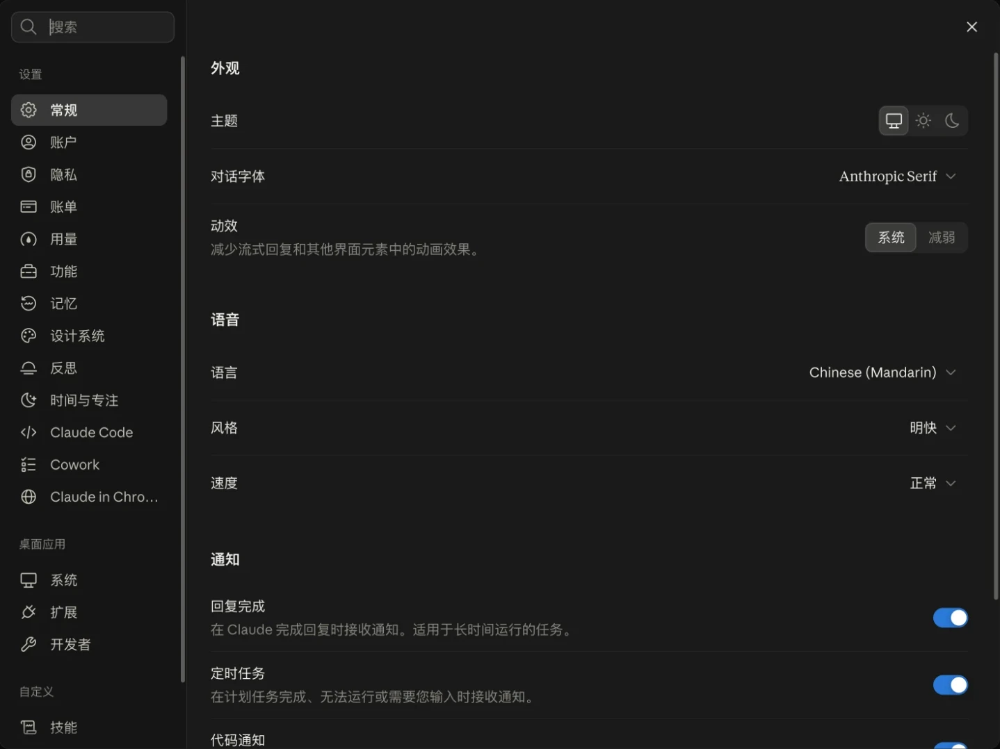

# Claude Desktop 简体中文补丁（macOS）

> **非官方项目。** 本项目与 Anthropic PBC 没有任何关联，未获得其认可、赞助或授权。
> Claude、Claude Desktop、Anthropic 是 Anthropic PBC 的商标，本文提及仅用于说明兼容对象。

让 macOS 版 Claude Desktop 显示**简体中文**界面：界面主体直接使用 claude.ai 官方的简体中文译文，
本项目只补上官方还没有翻译的桌面外壳（原生菜单、对话框、托盘、桌面专属设置），
并且**不改你的账号语言**、**不影响官方自动更新**。



## 目录

- [它做了什么](#它做了什么)
- [声明与风险](#声明与风险)
- [环境要求](#环境要求)
- [快速开始](#快速开始)
- [日常使用](#日常使用)
- [技术原理](#技术原理)
- [命令一览](#命令一览)
- [翻译外壳文案](#翻译外壳文案)
- [目录结构](#目录结构)
- [常见问题](#常见问题)
- [许可证](#许可证)

## 它做了什么

| 部分 | 来源 | 本项目做的事 |
|---|---|---|
| 聊天界面、设置页等主体（约 3.2 万条） | claude.ai 官方 `zh-Hans` 译文，App 运行时自己从 claude.ai 下载 | 让桌面端主窗口使用这份译文 |
| 桌面外壳（菜单、对话框、托盘等，约 700 条） | 官方没有中文 | 社区翻译，写入 App |
| 语言选择器 | 官方灰度，大多数账号看不到「中文（简体）」 | 让它常驻选择器，可随时切换 |
| 官方自动更新 | — | 重签名时保留官方签名要求，更新照常 |
| 系统权限（辅助功能、屏幕录制等） | 签名变了会失效 | 自动诊断，一键重置后重新授权 |

## 声明与风险

- **非官方、无担保。** 本工具会修改 `/Applications/Claude.app` 并重新签名（ad-hoc）。
  请自行判断是否符合 Anthropic 的使用条款；一切后果由使用者自负。
- **不分发官方译文。** 界面主体的中文由 App 在运行时从 claude.ai 下载，本仓库不包含、也不转发
  Anthropic 的译文或英文原文（本机抽取的中间文件都在 `extracted/`，不进版本库）。
- **重签名的副作用：**
  - 启动时可能弹出钥匙串密码框（见[常见问题](#为什么启动时要输入钥匙串密码)）；
  - 绑定 Anthropic 开发者团队的钥匙串访问组被移除，依赖它的功能（例如部分硬件密钥 / WebAuthn、
    Microsoft SSO）可能不可用，普通邮箱或 Google 登录不受影响；
  - 之前授予的系统权限需要重新授权一次（本工具会引导你完成）。
- **随官方更新可能失效。** 官方改了代码结构时，脚本会定位失败并**拒绝修改**，不会盲改；
  此时 App 保持官方原样，等本项目适配即可。

## 环境要求

- macOS（Apple Silicon 或 Intel），Claude Desktop 2.x（在 2.9939.2 上测试）
- Python 3.10+（系统自带或 Homebrew 均可）
- Node.js（用 `npx @electron/asar` 解包 / 重打包 `app.asar`）
- Xcode 命令行工具（`codesign`、`csreq`；运行 `xcode-select --install` 安装）
- `/Applications/Claude.app` 的属主是当前用户（从官网拖进「应用程序」的默认情况就是），**不需要 sudo**

## 快速开始

```bash
git clone https://github.com/dazi2011/claude-zh.git
cd claude-zh
python3 zhpack.py install
```

`install` 在临时目录里完成全部修改、校验和启动测试，都通过了才替换正式 App，
原版会备份到 `/Applications/Claude.backup-before-zh-CN-<时间>.app`。

装完之后：

1. **⌘Q 退出 Claude 再打开。** 窗口会自动刷新一次，之后就是简体中文。
2. **钥匙串密码框：** 如果弹出「Claude 想要使用钥匙串中的 Claude Safe Storage」，输入登录密码并选
   **「始终允许」**。
3. **系统权限：** `install` 结束时会检查辅助功能、屏幕录制等授权；发现因签名变化而失效的，会询问是否
   重置并打开对应的系统设置页，在设置页里把 Claude 重新打开即可（列表里没有就点「+」添加
   `/Applications/Claude.app`）。这一步只需要做一次，之后重装补丁、官方自动更新都不会再失效。

## 日常使用

### 切换语言

在 Claude 里打开 **设置 → 常规 → 语言**（或左下角头像菜单里的语言入口），「中文（简体）」和官方其它
语言并列，随时可以来回切换，选择会被记住，重启后保持：

- 选 **中文（简体）**：只在本机生效，不会提交到账号（官方目前不允许账号设成这门语言）；
- 选 **English 等其它语言**：和官方行为一致，会同时修改账号语言（网页版、手机端跟着变）。

### App 自动更新之后

官方自动更新照常工作。更新会把整个 App 换成官方版，中文随之消失（签名封条本来就不该跟着走），
重新运行一次即可：

```bash
python3 zhpack.py install
```

如果官方新版增加了外壳文案，没翻到的会暂时显示英文，见[翻译外壳文案](#翻译外壳文案)。

### 系统权限不好用了

```bash
python3 zhpack.py permissions          # 诊断
python3 zhpack.py permissions --reset  # 重置失效项并打开设置页
python3 zhpack.py permissions --all    # 连麦克风、摄像头等一起重置
```

### 卸载

```bash
python3 zhpack.py uninstall
```

从官方原版备份恢复，当前的汉化版移到废纸篓。也可以直接从 <https://claude.ai/download> 下载覆盖安装，
或者等下一次官方自动更新。

## 技术原理

以下基于 Claude Desktop 2.9939.2 的实测。

### 1. 官方已经有简体中文，只是在灰度里

1p（claude.ai 账号）模式下，Claude Desktop 的主窗口直接加载 `https://claude.ai`，
界面文字由网页端（下称 SPA）按当前语言下载 `/i18n/<locale>.json`。

claude.ai 页面里的 `<meta name="i18n-catalogs">` 列出了当前可用的全部目录，除了选择器里常见的
11 种语言，还有 `zh-Hans`、`zh-Hant` 等扩展语言。官方 `zh-Hans` 目录有 32016 条、98% 已翻译，
和法语目录的键完全一致。只要 SPA 的当前语言是 `zh-Hans`，它就会去下载这份目录。

但这门语言在灰度中：

- 语言选择器列出哪些扩展语言，由 GrowthBook 特性 `witty_scone_main` 的 `released` 列表决定，
  大多数账号的列表里只有那 11 种；
- 账号语言也设不成它：`PUT /api/account_profile {"locale":"zh-Hans"}` 返回
  `400 locale: Input is not one of the permitted values.`

### 2. 本地语言钩子：只在桌面端主窗口里用中文

SPA 登录后按**启动数据**（`/edge-api/bootstrap…` 的响应）顶层的 `locale` 字段决定界面语言，
并把它写进 `localStorage["spa:locale"]`。启动数据有两条来路：HTML 里内联的预加载脚本和 SPA
自己发的请求，都走 `window.fetch`。

所以本项目往 `app.asar` 的主进程代码里插入一小段（`asarpatch.hook_js`），用 Chrome 调试协议的
`Page.addScriptToEvaluateOnNewDocument`，在主窗口每次加载时、任何页面脚本之前运行一段页面脚本
（`asarpatch.shim_js`），包一层 `window.fetch`：

1. 启动数据回来时，把顶层 `locale` 改成 `zh-Hans`，其余字段原样；
2. 往 `witty_scone_main` 的 `released` 里补上 `zh-Hans`，让它常驻语言选择器；
3. 你在选择器里选中文时，账号接口会拒绝，这一次提交在本地直接应答成功，并把选择记在
   `localStorage["claude-zh:locale"]`；选其它语言照常提交给服务端，之后也不再强制中文。

注入细节：

- **注入点**是主进程里官方自己的 `session.defaultSession.webRequest.onBeforeRequest(…"webrequest:before-request"…)`
  回调的开头。不另外注册监听器：Electron 同一个 session 只保留最后一个 `onBeforeRequest`，
  另起一个会把官方逻辑顶掉。锚点用结构正则匹配，要求全局唯一命中，不写死混淆后的变量名。
- **只动主窗口**：默认 session 上、导航到 claude.ai 的页面。内置浏览器面板、预览窗口等 App
  自己也要用调试器的页面一概不碰。
- **首次加载刷新一次**：官方是先发出主窗口的加载、后注册 `onBeforeRequest`，所以主窗口的第一篇文档
  必然早于钩子。钩子武装后检查页面脚本是否「赶在了前面」，没有就重载一次（每个窗口最多一次）。
- 整段注入代码首尾带注释标记 `/*claude-zh-locale:begin*/ … /*claude-zh-locale:end*/`，重装时整块替换。

界面文字全部来自官方目录：本项目**不改写任何界面文字、不拦截 i18n 请求、不碰对话内容**。

### 3. 桌面外壳

原生菜单、对话框、托盘、桌面专属设置页由 Electron 主进程渲染，它只认
`Contents/Resources/<locale>.json`（官方没有中文）。SPA 每次切换语言都会调用
`window.electronIntl.requestLocaleChange(locale)` 通知外壳，外壳找得到 `zh-Hans.json` 就跟着切换，
找不到就回落英文。所以本项目写入：

- `Contents/Resources/zh-Hans.json`：由 `translations/desktop.zh-Hans.json` 按官方英文原文逐键合并而成，
  缺译或占位符不一致的条目自动回落英文，保证键集完整；
- `Contents/Resources/zh_CN.lproj/Localizable.strings`：原生 Swift 界面（快速输入等）的字符串；
- `~/Library/Application Support/Claude/config.json` 的 `locale`：外壳启动时的初始语言。

### 4. 重签名与签名要求（DR）

修改了 `Contents` 就破坏了代码签名封条，只能 ad-hoc 重新签名。这里有三个坑：

1. **team 绑定的 entitlement**：ad-hoc 签名没有 Team ID，保留 `keychain-access-groups` 等会让
   内核在启动时直接杀掉进程（Taskgated Invalid Signature），必须剔除；同时关闭 library validation，
   否则加载自带的 framework 会失败。
2. **自动更新**：Squirrel.Mac 安装更新前，会用**当前运行的 App** 的指定要求（designated requirement，
   DR）校验下载下来的新版（`SecCodeCopySelf` → `SecCodeCopyDesignatedRequirement` →
   `SecStaticCodeCheckValidityWithErrors`）。ad-hoc 签名默认合成的 DR 是 `cdhash H"…"`，
   官方新版永远对不上，更新会一直报
   `Code signature … did not pass validation: code failed to satisfy specified code requirement(s)`。
3. **系统权限和钥匙串**：TCC、钥匙串记住的也是 App 的 DR。`cdhash` 形式的 DR 每重签一次就变一次，
   之前的授权随之失效。

所以重签名时显式写入一条固定的 DR：

```
designated => (官方 Developer ID 的那条 DR)
           or (identifier "com.anthropic.claudefordesktop" and ! anchor apple generic)
```

- 官方新版满足第一支 → 自动更新照常；
- 汉化版自己满足第二支 → 系统权限和钥匙串授权在重签、官方更新、再次安装之间保持有效。

官方那条 DR 在修改前从 App 上读出，并缓存到 `extracted/upstream.designated-requirement.txt`；
都读不到时按 Developer ID 的标准形状（团队 `Q6L2SF6YDW`）生成，与官方安装包逐字一致。

### 5. 系统权限的诊断与修复

`permissions` 以**只读**方式打开系统 TCC 数据库（`/Library/Application Support/com.apple.TCC/TCC.db`），
取出 Claude 每条「允许」授权所记住的签名要求，逐条验证当前 App 是否满足；不满足的才用
`tccutil reset <服务> com.anthropic.claudefordesktop` 重置（普通身份失败时改用管理员身份，
由系统弹出密码 / Touch ID 框），然后打开对应的系统设置页由你重新授权。

本项目**不直接写 TCC.db**：系统库受 SIP 保护，直接写入等于绕过 macOS 的授权机制。
读取它需要运行终端拥有「完全磁盘访问」权限；读不到时只能按常见项（辅助功能、屏幕录制）重置。
麦克风、摄像头等记在用户级 TCC 库里，读不到，用 `permissions --all` 整体重置。

### 6. 安装流程的安全网

1. 用 `ditto` 把 App 复制到临时目录，所有修改都在副本上进行；
2. 解包 `app.asar` → 注入钩子 → 重打包，还原 `app.asar.unpacked` 的权限位（`asar extract` 会把它们
   抹成 644，终端、MCP 等可执行文件会因此起不来），更新所有 `Info.plist` 里的
   `ElectronAsarIntegrity` 哈希（哈希的是 asar 头部 JSON，不是整个文件）；
3. 由内向外完整重签名；
4. 静态校验：钩子、外壳字典、asar 完整性、执行位、签名结构、entitlement、DR；
5. 用临时配置目录真正启动一次副本（带 `--use-mock-keychain`，不打扰钥匙串），确认不会被内核杀掉；
6. 全部通过才用 `mv` 替换正式 App。正在运行的实例持有旧文件，不受影响，什么时候重启由你决定；
   本工具也不会去杀进程（它可能正运行在 Claude 自己的终端里）。

备份策略：官方原版保留最新一份（`Claude.backup-before-zh-CN-*`，`uninstall` 用它恢复），
上一版汉化包保留最新一份（`Claude.zh-prev-*`，手动回滚用），更早的移到废纸篓。

附带修复：macOS 26 上 Claude Code 的 iOS 模拟器会因沙盒缺一条 `(allow system-info)` 而反复崩溃，
官方原版同样存在。既然要重签名，`install` 顺手给 `claude-ios-sim.sb` 补上这一条（已有则跳过）。

## 命令一览

| 命令 | 作用 |
|---|---|
| `python3 zhpack.py install` | 安装 / 重装（App 更新后重跑一次） |
| `python3 zhpack.py install --dry-run` | 演练：全部步骤在临时目录里走一遍，不替换正式 App |
| `python3 zhpack.py status` | 签名、钩子、外壳字典、自动更新、系统权限、备份、译文覆盖率 |
| `python3 zhpack.py verify` | 校验已安装的补丁 |
| `python3 zhpack.py permissions [--reset] [--all]` | 诊断 / 修复因重签名失效的系统权限 |
| `python3 zhpack.py uninstall` | 从官方原版备份恢复 |
| `python3 zhpack.py extract` | 抽取外壳英文原文，生成待翻清单 |
| `python3 zhpack.py batch` / `merge` / `check` | 外壳文案的翻译工作流 |

所有命令都支持 `--app /path/to/Claude.app` 指定其它位置的 App。

## 翻译外壳文案

官方新版可能增加外壳文案，流程如下：

```bash
python3 zhpack.py extract                 # 看新增了多少条
python3 zhpack.py batch --size 200        # 切一批 → extracted/batch.desktop.0-200.json
#   把值翻译成中文，另存为 extracted/batch.desktop.0-200.done.json
python3 zhpack.py merge extracted/batch.desktop.0-200.done.json
python3 zhpack.py check                   # 占位符 / 标签 / 用词体检
python3 zhpack.py install                 # 装上
```

- `merge` 逐条校验 ICU 占位符（`{name}`、`{count, plural, …}`）和标签（`<link>…</link>`），
  不一致的直接拒绝；
- 译文与英文相同表示有意保留英文（产品名、缩写等），会记进 `translations/keep-english.json`；
- 术语和风格约定见 `glossary.json`。注意官方主体译文使用「您」，本仓库的外壳译文按术语表使用「你」。

## 目录结构

```
zhpack.py                      命令行工具（安装、校验、权限、翻译工作流）
asarpatch.py                   app.asar 注入：本地语言钩子、重打包、完整性哈希
translations/
  desktop.zh-Hans.json         桌面外壳译文（按官方消息 ID 索引）
  menu.zh-Hans.strings         原生 Swift 界面译文
  keep-english.json            有意保留英文的外壳键
glossary.json                  术语表与风格约定
tests/                         页面脚本行为测试（Node）与纯逻辑测试（Python）
docs/screenshot.webp           效果图
extracted/                     本机生成的中间产物（不进版本库）
```

运行测试：

```bash
python3 -m unittest discover -s tests
node tests/shim.test.mjs
```

## 常见问题

### 语言可以随时切换吗？

可以。「中文（简体）」常驻语言选择器，和其它语言之间随时来回切换，选择重启后保持。
选中文只在本机生效；选其它语言会同时修改账号语言，这一点和官方行为一致。

### 官方译文会自动更新吗？

会。译文不在本仓库里，也不在 App 包里：App 每次启动都按 claude.ai 页面声明的版本号
（`/i18n/zh-Hans.json?v=<哈希>`）从 claude.ai 下载最新的官方目录，官方改进译文你会自动拿到。
本项目只需要维护外壳那几百条。

### 会影响网页版和手机端吗？

不会。钩子只作用于这台电脑上 Claude Desktop 的主窗口；账号语言保持不变。
（反过来：在桌面端的语言选择器里选**非中文**语言，会像官方一样修改账号语言。）

### 为什么启动时窗口会闪一下？

主窗口第一次加载早于钩子就绪，钩子发现后会自动重载一次，之后的页面都会提前生效。

### 为什么启动时要输入钥匙串密码？

Claude 把本地数据的加密密钥存在钥匙串（「Claude Safe Storage」），钥匙串只信任它认识的签名。
重签名后第一次启动会询问，输入登录密码并选「始终允许」即可。

### 官方正式开放中文之后呢？

届时可以直接在官方选择器里选中文，本项目的钩子就没有必要了；外壳中文在官方提供之前仍需本项目。
想恢复官方原版：`python3 zhpack.py uninstall`，或者等下一次官方自动更新。

### 为什么不借一门现成语言（例如法语）当「载体」，或者直接改英文？

本项目早期版本就是借法语当载体：把 locale 设成 `fr-FR`，再把法语目录换成中文。问题是语言选择会
同步到账号，网页版、手机端都会变成法语，服务端下发的文案也是法语，需要维护一张「法语 → 中文」
对照表。英文是 SPA 内建语言，根本不发目录请求，只能逐条改写 JS 里的英文，覆盖率完全取决于自己的
翻译量，而且服务端文案、日期格式都是英文。官方中文出现之后，这两条路都不再划算。

## 许可证

[MIT](LICENSE)。外壳译文为社区翻译，随本仓库以同一许可证发布。
